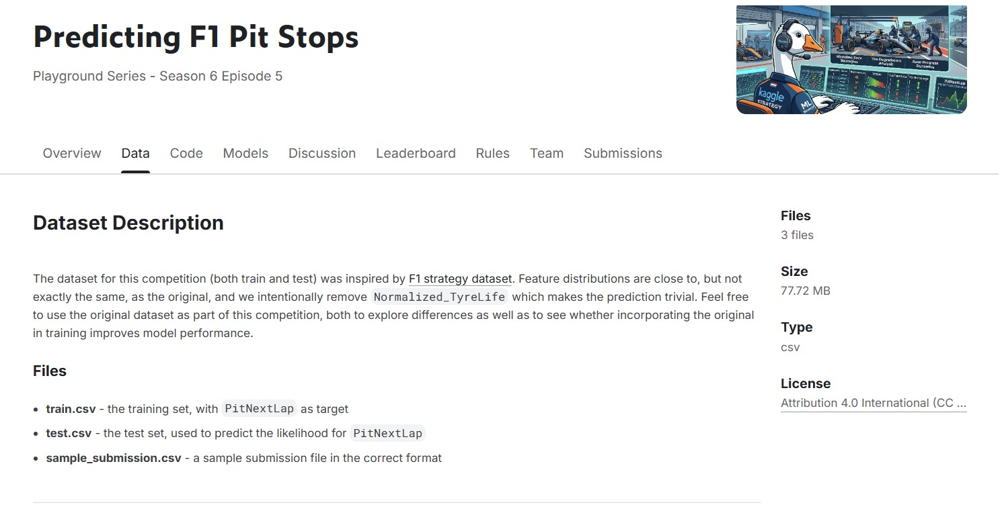

# 🏎️ Formula 1 Race Outcome Prediction Model

  
   
  <em>Figure: Model Performance Visualization & Pit Stop Detection</em>

This project aims to develop a **machine learning model** capable of predicting **Formula 1 race outcomes** using historical race data. The model estimates the probability of each driver winning a race while also identifying the optimal timing for **pit stops** based on tire degradation and race performance.

---

## 🚀 Key Features

* 📊 **Driver Consistency Analysis**
  Evaluates driver performance stability using the `Driver_Stability` feature derived from lap time variability.

* 🛞 **Pit Stop Strategy Prediction**
  Predicts pit stop requirements based on tire degradation (`Is_Worn_Out`) with class-weight tuning to improve sensitivity toward pit stop detection.

* 🏆 **Race Winner Prediction**
  Utilizes the **XGBoost Classifier** to estimate each driver's probability of winning the race.

---

## 🔬 Methodology

1. **Exploratory Data Analysis (EDA)**

   * Investigated the relationship between race performance and tire degradation.
   * Answered three key business questions:

     * How consistent is each driver's performance?
     * What pit stop patterns emerge during races?
     * What distinguishes the race winner's pace?

2. **Feature Engineering**

   * Created new predictive features such as:

     * `Driver_Stability`
     * `Cumulative_Degradation`

3. **Model Development**

   * Built an **XGBoost Classifier**.
   * Optimized the model using `scale_pos_weight` to address class imbalance.

4. **Model Evaluation**

   * Evaluated performance using:

     * **ROC-AUC Score:** **0.89**
     * **Classification Report**
     * **Recall:** **0.90** for pit stop detection

---

## 📈 Results & Insights

### 🏁 Winner Prediction

Based on the XGBoost model's inference, **Driver ID 875** was predicted as the most likely race winner with a **92.4% winning probability**.

### Why Was Driver 875 Predicted to Win?

* ✅ **Performance Consistency**

  * Exhibited the lowest lap time variance throughout the race.

* 🛞 **Efficient Tire Management**

  * Maintained strong performance during critical tire degradation phases.

* 🎯 **Strategic Pit Stop Execution**

  * Benefited from accurate and timely pit stop predictions generated by the model.

---

## 💡 Conclusion

The model demonstrates that success in Formula 1 depends on more than raw speed. Consistent driving performance, effective tire degradation management, and well-timed pit stop strategies collectively contribute to achieving the highest probability of victory.

---

## 🛠️ Tech Stack

* **Programming Language:** Python

* **Libraries:**

  * Pandas
  * NumPy
  * Scikit-learn
  * XGBoost
  * Matplotlib
  * Seaborn

* **Machine Learning Model:**

  * XGBoost Classifier

---

## 📊 Dataset

This project utilizes historical **Formula 1 race data**, including lap times, tire degradation, driver performance, and pit stop information for predictive modeling.

**Dataset Source:**
[https://www.kaggle.com/datasets](https://www.kaggle.com/competitions/playground-series-s6e5)

---

## 📜 License

This project was developed for **educational purposes** and **Data Science portfolio development**.

---

⭐ *Part of Owi's Data Science Portfolio.*
